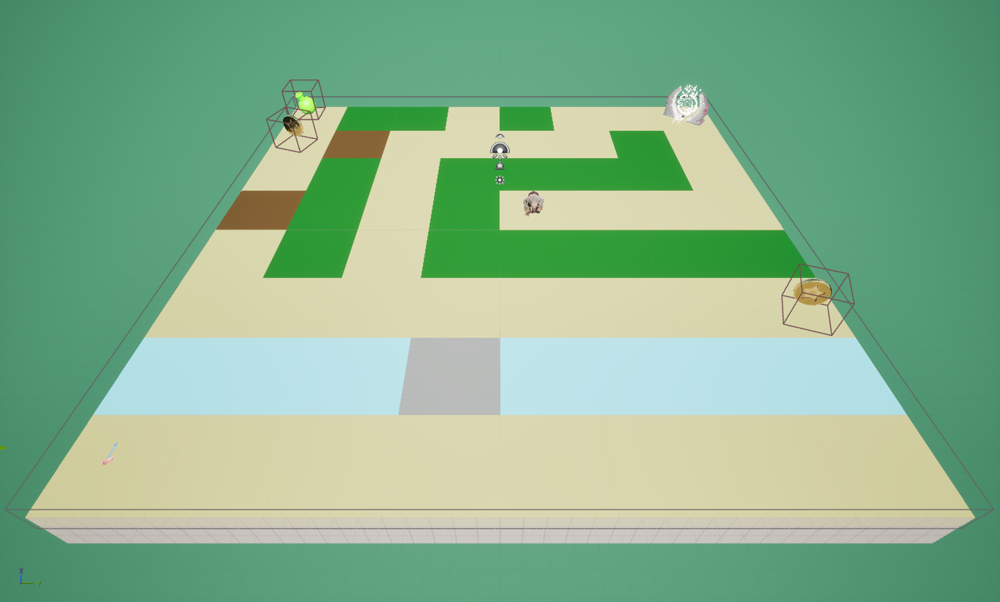
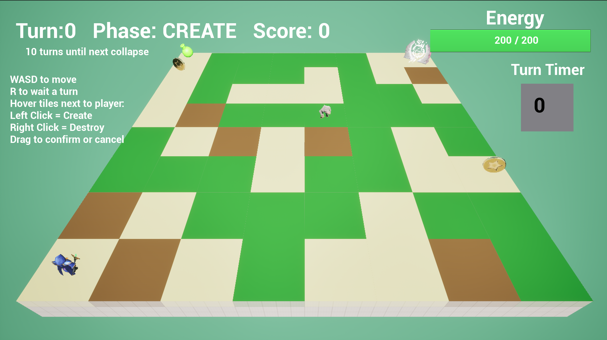
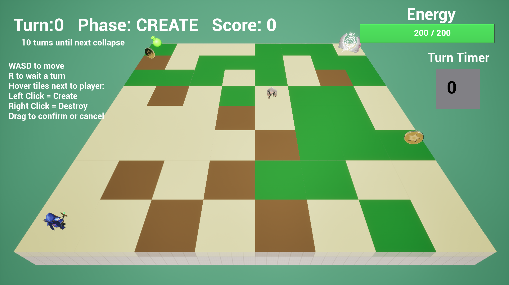
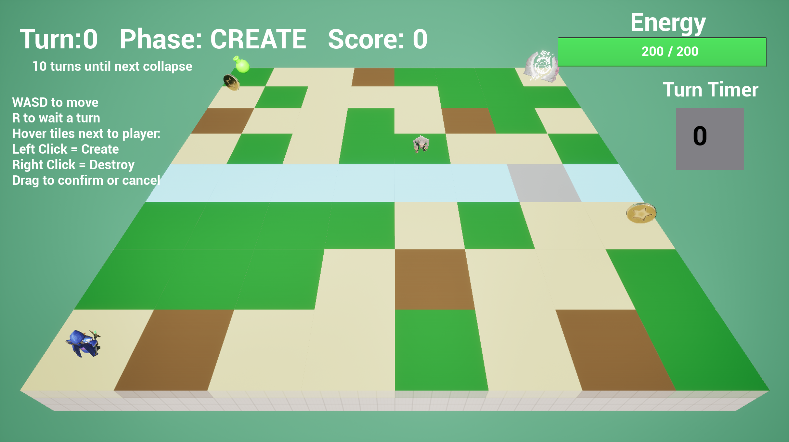

# Final Project!

This is it! The culmination of your procedural graphics experience this semester. For your final project, we'd like to give you the time and space to explore a topic of your choosing. You may choose any topic you please, so long as you vet the topic and scope with an instructor or TA. We've provided some suggestions below. The scope of your project should be roughly 1.5 homework assignments). To help structure your time, we're breaking down the project into 4 milestones:

## Project planning: Design Doc (due 11/5)
Before submitting your first milestone, _you must get your project idea and scope approved by Rachel, Adam or a TA._

### Design Doc
Start off by forking this repository. In your README, write a design doc to outline your project goals and implementation plan. It must include the following sections:

#### Introduction
What motivates your project?
- To furthur extend a project that I have worked on, allowing it to have more meaningful levels and be filled with 3D objects.

#### Goal
What do you intend to achieve with this project?
- Create an algorithm to procedurally generate meaningful grid-based map that coherent with existing game mechanics, then spawn 3D objects on each tile.

#### Inspiration/reference:
- [Wave Function Collapse](https://github.com/mxgmn/WaveFunctionCollapse)

#### Specification:
Outline the main features of your project

- An algorithm that generates the map
- The ability to spawn designated objects on each tile
- Allowing the objects to despawn and respawn following changes to the tile type in-game 

#### Techniques:
- Approach 1: Wave Function Collapse
  - First hand craft a few maps to showcase meaningful map definition, then feed them into the algorithm to produce map of similar and larger sizes.
  - The Algorithm will be implemented as described in the wave function collapse github.
- Approach 2: L-System-like spreading
  - Given a board with set size, player spawn location, and player's target exit, starts from the spawn point and "grow" one tile in all directions each step until the entire board is filled.
  - The new tiles generated each step depends on the two closest tiles around it, following a set of rules with possibilities.
 
    
#### Design:

#### Timeline:
- Week 1
  - Barebone of the algorithm that generates "something", may not be meaningful yet.
- Week 2
  - Tune the generation rules so that the output fits the game mechanics more.
- Week 3
  - Finalize the algorithm tuning, start adding objects to the generated map.
- Week 4
  - Final polish for the visual output.

## Milestone 1 
Created the blueprint framework that reads the current map size and generate a map with randomized tile type. The current version is simply assigning types with a random number generator, but final version will be implemented with algorithms that generates map that make sense to the game mechanics.

Original hand-crafted map:

 

Sample randomly generated maps:

 

 

 

## Milestone 2
Implemented the main feature of Wave Function Collapse algorithm. The generated map now learns adjacency rules from the original hand-crafted map so that the placement of tiles should make more sense now. 

Original hand-crafted map altered to satisfy more adjacency rules:

 

Sample Wave Function Collapse algorithm generated maps:

 

 

 

## Final submission (due 12/1)
Time to polish! Spen this last week of your project using your generator to produce beautiful output. Add textures, tune parameters, play with colors, play with camera animation. Take the feedback from class critques and use it to take your project to the next level.

Submission:
- Push all your code / files to your repository
- Come to class ready to present your finished project
- Update your README with two sections 
  - final results with images and a live demo if possible
  - post mortem: how did your project go overall? Did you accomplish your goals? Did you have to pivot?

